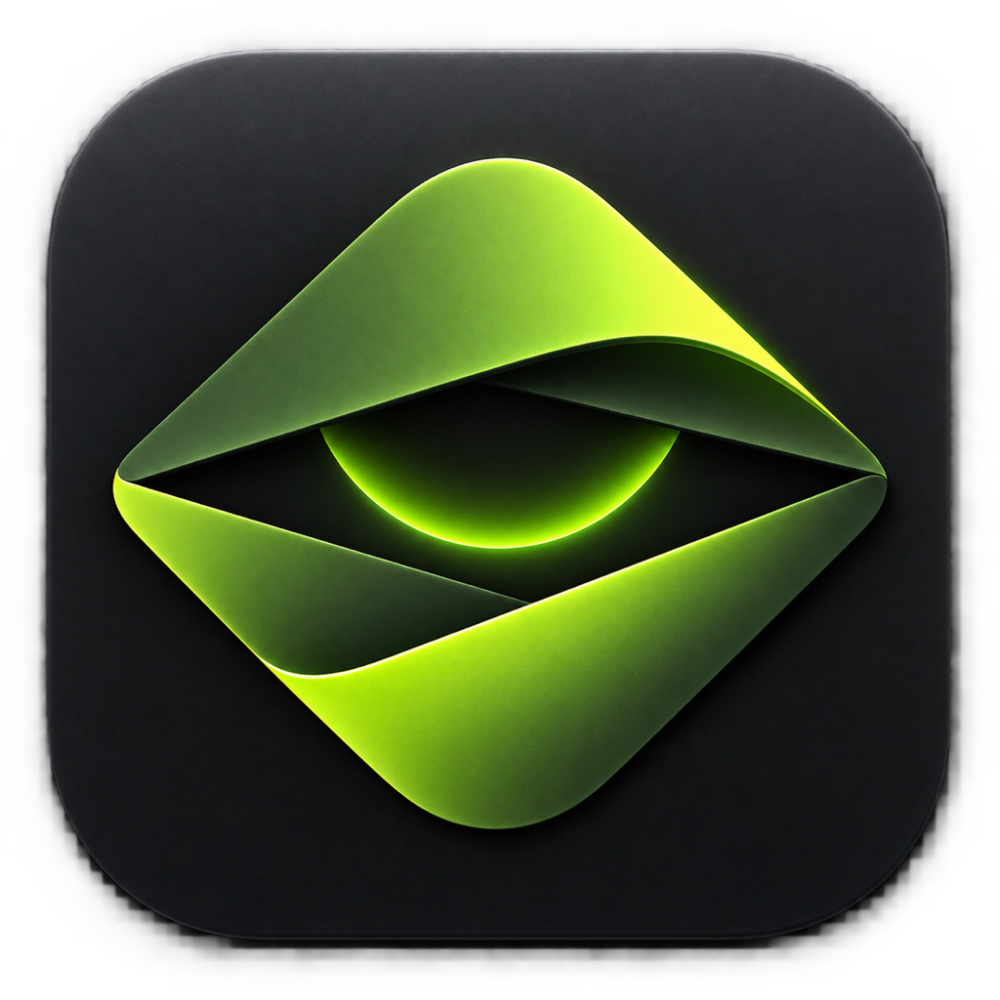

<p align="center">
  
</p>

<h1 align="center">hide</h1>

<p align="center"><strong>Your agent workspaces, without the window hunt.</strong></p>

<p align="center">
  A quiet native macOS workspace for Herdr, local and remote terminals, and coding agents.
</p>

<p align="center">
  
  
  
  
  
  <a href="LICENSE"></a>
</p>

hide is a dark, native macOS workspace navigator built on [Herdr](https://github.com/herdrdev/herdr).
It brings local and remote workspaces, checkouts, terminal panes, files, and coding agents into one keyboard-first window while leaving session state and credentials with the tools that own them.

## Why hide

- **One map of active work.** Navigate Herdr workspaces, checkouts, tabs, panes, and agent activity from a single sidebar.
- **Terminals stay where the work is.** Attached Herdr panes render in place with their real layout, focus, zoom, scrollback, and terminal state.
- **Agents start in the right checkout.** Launch Claude Code or Codex from the selected workspace without rebuilding its context by hand.
- **Local and remote stay distinct.** Work on this Mac or an SSH-connected Mac while keeping remote file writes inside the attached terminal.
- **Files remain understandable.** Browse and edit existing local files in the Workbench, with remote trees exposed as read-only context.
- **Attention is visible.** Agent state, blocked work, failures, and the optional desktop pet make the next action easy to spot.

## How it works

```text
Herdr server and panes
        │
        │ versioned snapshots + terminal chunks
        ▼
herdr-core (Rust)
        │
        │ six-function C ABI with typed JSON events
        ▼
hide (SwiftUI + SwiftTerm)
        │
        ├─ workspace and checkout navigator
        ├─ live pane layout and terminal surfaces
        ├─ local Workbench and remote read-only tree
        └─ agent launcher, settings, and desktop pet
```

The Rust core owns the authoritative runtime state behind one snapshot boundary.
The Swift shell renders that state and sends typed user events back, so the UI does not maintain a competing model of the session.

## Install

hide currently ships for Apple Silicon Macs running macOS 14 or later.
If the [Releases](https://github.com/modakbul-gongbang/hide/releases) page has no public build yet, install from source:

```sh
git clone https://github.com/modakbul-gongbang/hide.git
cd hide
./scripts/build-app.sh
sudo /usr/bin/ditto --rsrc --extattr --qtn dist/hide.app /Applications/hide.app
open /Applications/hide.app
```

The source build creates an ad-hoc signed `dist/hide.app`, a versioned zip archive, and a SHA-256 sidecar.
It also bundles the pinned Herdr v0.8.2-preview.2026-09-06-13d8d0b99033 runtime, so a separate Herdr install is not required for a first launch.

See [Install hide](docs/INSTALL.md) for prerequisites, release checksum verification, Gatekeeper steps, first-launch behavior, updates, and troubleshooting.

## Runtime boundaries

- hide starts the Herdr it bundles when no local Herdr server is running.
  A server that is already running is used as it is when it speaks the protocol hide was built against, and hide says what to do when it does not.
- hide does not collect or store SSH credentials, Herdr credentials, or agent CLI credentials.
- Claude Code and Codex remain separate tools and must already be installed and signed in if you want to launch them from hide.
- Remote Workbench trees are read-only.
  Remote edits stay in the terminal attached to that remote Herdr session.

<!-- herdr-provenance:start -->
hide distributes a modified Herdr preview from the [modakbul-gongbang/herdr fork](https://github.com/modakbul-gongbang/herdr/releases/tag/preview-2026-09-06-13d8d0b99033), built from commit `13d8d0b99033`.
This fork supplies host-scoped snapshots, ordered event sequences, and agent lineage that the upstream stable release does not yet expose.
The weekly `herdr-update.yml` workflow continues to propose upstream stable releases with `--repo herdrdev/herdr`; return to upstream when the contract field tests and runtime checks pass.
<!-- herdr-provenance:end -->

## Development

Contributions go through pull requests gated by the `verify` workflow; `CONTRIBUTING.md` lists the gates and how to run them locally, and `SECURITY.md` says how to report a vulnerability privately.

Prerequisites are Swift 6, the macOS 14 SDK or newer, and a Rust toolchain with Rust 2024 edition support.

```sh
cargo test --workspace --locked
swift test --package-path macos --disable-keychain --disable-sandbox
macos/scripts/build_dev_app.sh
```

The development build is assembled at `macos/build/assembled/hide.app`.
The release bundle and archive are produced by `./scripts/build-app.sh` under `dist/`.

Repository map:

- `macos/` - the production SwiftUI shell and macOS bundle resources.
- `herdr-core/` - the platform-neutral Rust runtime and C ABI.
- `assets/pet-theme/` - the bundled desktop pet theme.
- `contracts/` - the pinned Herdr protocol contract.
- `docs/` - architecture, runtime, installation, and verification notes.

Before visual verification, read [Which app is actually running](docs/dev-runtime.md) and confirm exactly one `HerdrMacOS` process is active.

## Design and license

The interface follows the design contract in [DESIGN.md](DESIGN.md) and uses original SwiftUI code.
hide is available under the [MIT License](LICENSE).
